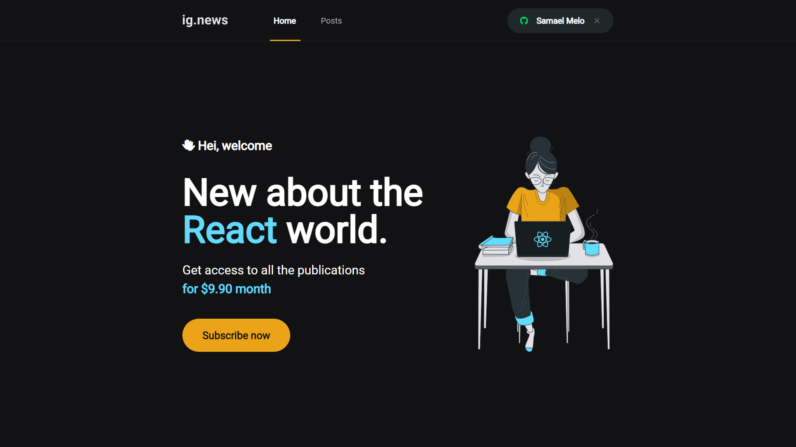
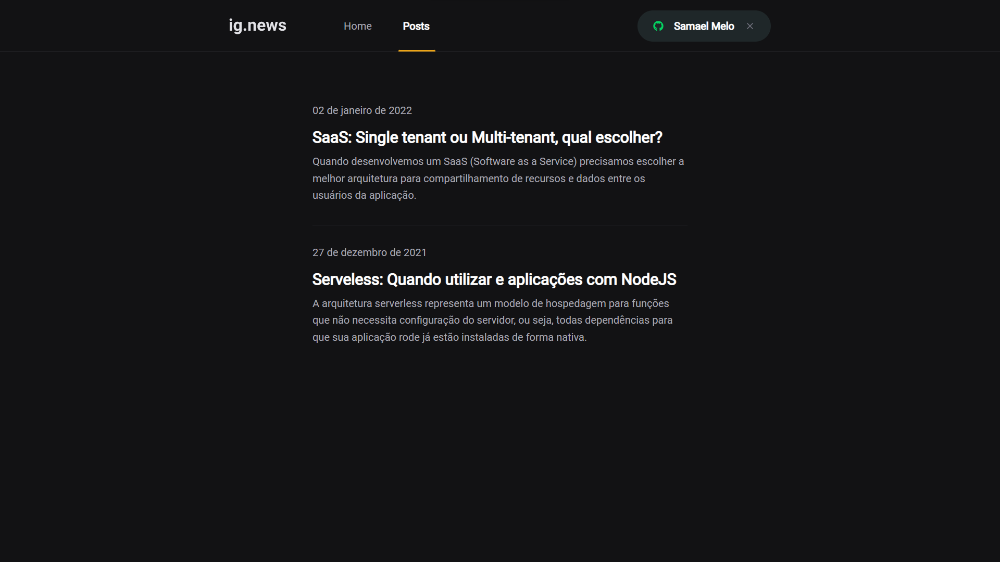

<h1 align="center">ig.news</h1>
<h2 align="center">Rocketseat - Ignite - ReactJS</h2>

<h3 align="center">Chapter #3</h3>

  <a href="#-Project">Project</a>&nbsp;&nbsp;&nbsp;|&nbsp;&nbsp;&nbsp;
  <a href="#hammer_and_wrench-Features">Features</a>&nbsp;&nbsp;&nbsp;|&nbsp;&nbsp;&nbsp;
  <a href="#-Technologies">Technologies</a>&nbsp;&nbsp;&nbsp;|&nbsp;&nbsp;&nbsp;
  <a href="#-Layout">Layout</a>&nbsp;&nbsp;&nbsp;|&nbsp;&nbsp;&nbsp;
  <a href="#-How-to-execute">How to execute</a>&nbsp;&nbsp;&nbsp;|&nbsp;&nbsp;&nbsp;
  <a href="#-Licence">Licence</a>

  

##

## 💻 Project

ig.news é uma plataforma para compartilhar conteúdo de texto por meio de assinatura. Este  é o terceiro projeto desenvolvido em React no curso Ignite da [Rocketseat](https://rocketseat.com.br/).

## :hammer_and_wrench: Features

- [x] Login social com Github OAuth
- [x] Administrando pagamentos com o Stripe
- [x] Administrando usuarios e inscrições com FaunaDB
- [x] Administtrando conteudos de post com Prismic CMS

## ✨ Technologies

This project was developed with the technologies above:

- [React](https://reactjs.org)
- [TypeScript](https://www.typescriptlang.org)
- [NextJS](https://nextjs.org)
- [Stripe](https://stripe.com)
- [Sass](https://sass-lang.com)
- [NextAuth](https://next-auth.js.org)
- [React-icons](https://react-icons.github.io/react-icons)
- [FaunaDB](https://www.fauna.com)
- [Prismic CMS](https://prismic.io)

## 🔖 Layout

Veja o layout do projeto [neste link](https://www.figma.com/file/tJ7aBsWFbHGxpK3wyY6Eoh/ig.news). Você deve ter uma conta [Figma](http://figma.com) para acessar.

## 🚀 How to execute

- Clone o repositório.
- Crie um novo repositorio no [Prismic](https://prismic.io)
- Crie um banco de dados no [FaunaDB](https://www.fauna.com)
- Crie uma conta no stripe[Stripe](https://stripe.com)
- Configure suas variáveis de ambiente
- Instale as dependencias com  `yarn`
- Execute a aplicação com `yarn dev`
- Acesse [`localhost:3000`](http://localhost:3000) no seu browser

## 📄 Licence

Este projeto possui lincença MIT. Veja o arquivo [LICENSE](./LICENSE) para mais detalhes.

---

